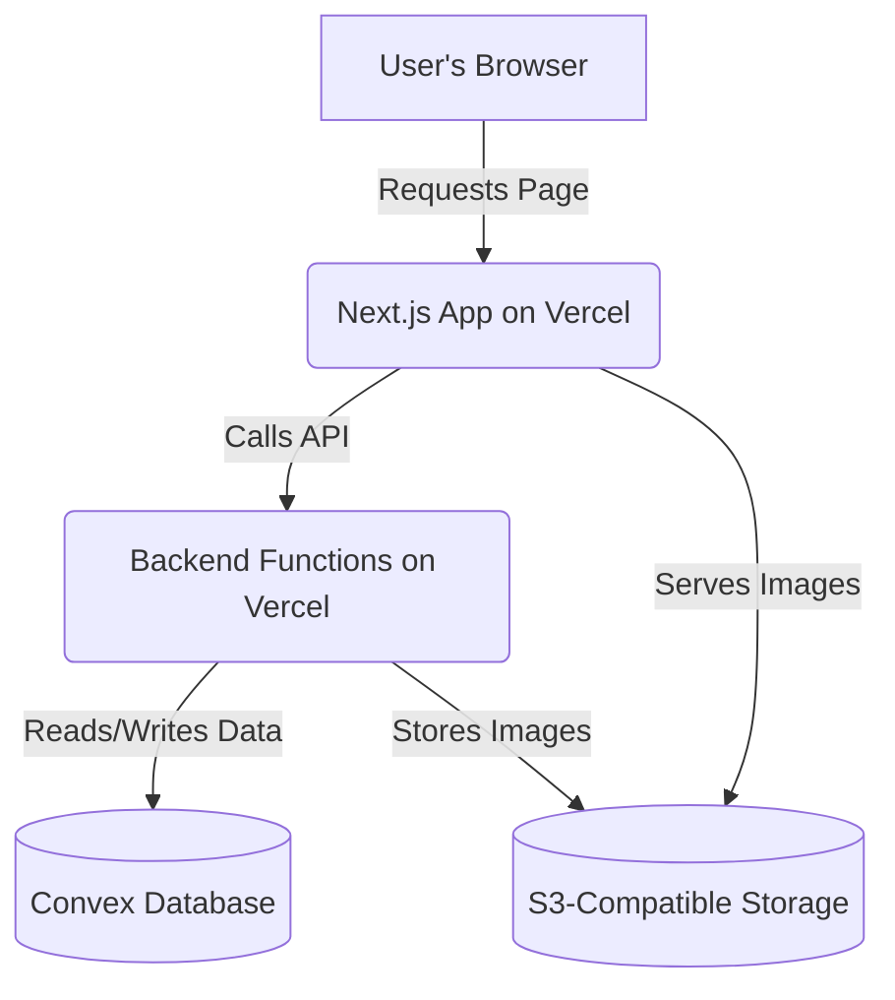
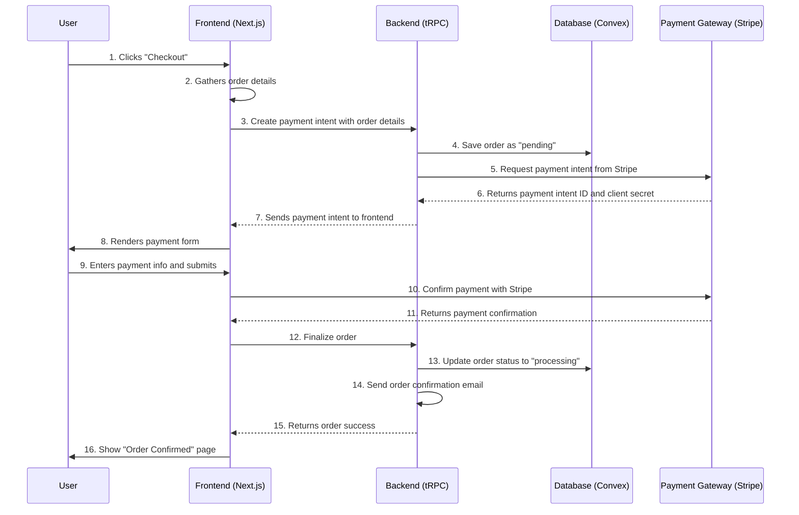

# Monkkey Webshop Fullstack Architecture Document

## Introduction

This document outlines the complete fullstack architecture for the Monkkey Webshop, including backend systems, frontend implementation, and their integration. It will serve as the single source of truth, ensuring consistency across the entire technology stack.

The unified approach combines what would traditionally be separate backend and frontend architecture documents, streamlining the development process for a modern fullstack application.

## High Level Architecture

### Technical Summary

The Monkkey webshop will be built on a modern fullstack architecture using the T3 stack. We will use a monorepo structure to house a Next.js frontend, backend API functions, and shared code. The platform will leverage a serverless deployment model on a modern cloud provider, ensuring scalability, reliability, and cost-effectiveness. A central database will store all product and order data, while the frontend will be built with a component-based approach that adheres to the UI/UX specification.

### Platform and Infrastructure Choice

We will proceed with Vercel as our deployment platform and Convex as our database backend. This combination is the most modern, efficient, and developer-friendly stack for our project.

### Repository Structure

We will use a Monorepo structure. All of our code—including the Next.js application, backend functions, and shared components—will be housed in a single repository. This simplifies dependency management, centralizes our codebase, and ensures full-stack type safety out of the box.

### High Level Architecture Diagram



### Architectural Patterns

Component-Based UI: The frontend will be built with reusable React components to ensure a consistent look, feel, and functionality across the entire site.

Serverless Architecture: We will use serverless functions for our backend logic, which will be cost-effective, scalable, and easy to deploy with Vercel.

Repository Pattern: We will abstract our data access logic to ensure that our application code is not tightly coupled to the database. This makes the code easier to test and allows us to change data sources in the future if needed.

## Tech Stack

This is the definitive technology selection for the entire project. All development will be based on these choices.

### Technology Stack Table

| Category | Technology | Version | Purpose | Rationale |
|----------|------------|---------|---------|-----------|
| Frontend Language | TypeScript | 5.3.3 | Primary development language | Strong typing, excellent tooling, team expertise |
| Frontend Framework | Next.js | 14.1.0 | Full-stack React framework | Serverless functions, component-based UI, built-in features for a complete web application. |
| Backend Framework | Next.js API Routes | 14.1.0 | Backend framework | Serverless functions, built-in routing, and a natural fit for the T3 stack. |
| API Style | tRPC | 10.43.3 | API layer | End-to-end type safety between the frontend and backend, eliminating a common source of bugs. |
| Database | Convex | Latest | Primary data storage | Modern serverless database with seamless integration with Next.js and Vercel. |
| Styling | Tailwind CSS | 3.4.1 | CSS framework | Utility-first framework for rapid, consistent UI development. |
| UI Component Library | Shadcn | Latest | Component library | A collection of re-usable, accessible, and customizable components built with Tailwind CSS. |
| Authentication | NextAuth.js | 4.24.5 | Authentication | Secure and easy-to-implement authentication for our users. |
| Deployment | Vercel | Latest | Cloud provider & hosting | Creator of Next.js, providing a seamless deployment experience with serverless functions and global CDN. |
| Testing | Jest / React Testing Library | Latest | Testing framework | A robust and widely-used solution for unit and integration testing. |
| Build Tool | Vite | 5.0.12 | Build tool | Extremely fast build and hot reloading for a smooth development experience. |

## Data Models

### Product

Purpose: To store all product-related information, including details for both physical goods and customization options.

Key Attributes:
- name: The name of the product.
- description: A detailed description of the product.
- price: The price of the product.
- images: A list of high-quality image URLs.
- videos: A list of video URLs to showcase the product.
- stock: The current inventory level.
- customization_options: An array that defines each personalization area.

Relationships: A Product can be part of many GiftBox models.

### Order

Purpose: To track all customer purchases, from the moment an order is placed to when it is delivered.

Key Attributes:
- customer_id: A reference to the Customer model.
- items: A list of products and their specific personalization details.
- status: The current status of the order.
- total_price: The total cost of the order.
- shipping_info: The customer's shipping address.

Relationships: An Order belongs to a single Customer and contains multiple Product or GiftBox models.

### Customer

Purpose: To store customer data, which is required for processing orders and communication.

Key Attributes:
- name: The customer's full name.
- email: The customer's email address.
- phone_number: The customer's phone number.
- address: The customer's billing and shipping addresses.

Relationships: A Customer can place many Order models.

### GiftBox

Purpose: To store a collection of products that a customer has assembled into a gift box.

Key Attributes:
- items: A list of strings (references to products collection IDs).
- totalPrice: The combined price of all products in the gift box.
- personalizationMessage: A message for the gift box as a whole.

Relationships: A GiftBox contains multiple Product models.

### CorporateBillingInfo

Purpose: To store corporate-specific billing and tax information.

Key Attributes:
- customer_id: A reference to the Customer model.
- company_name: The name of the company.
- tax_id: The company's tax identification number.
- billing_contact: The name and email of the billing contact.

Relationships: A CorporateBillingInfo model belongs to one Customer.

## Unified Project Structure

```
monkkey-webshop/
├── .github/
│ └── workflows/
├── apps/
│ └── web/
│ ├── public/
│ ├── src/
│ │ ├── components/
│ │ ├── pages/
│ │ ├── styles/
│ │ └── trpc/
│ ├── types/
│ └── package.json
├── packages/
│ ├── shared-types/
│ └── ui/
├── docs/
├── infrastructure/
├── package.json # CRITICAL: This is the root package.json for the monorepo
├── tsconfig.json
└── README.md
```

## Development Workflow

Prerequisites: You will need git and Node.js installed on your machine.

### Initial Setup

1. Clone the repository from your chosen version control system (e.g., GitHub, GitLab).
2. Navigate to the project root in your terminal.
3. Run the command npm install to install all dependencies for the monorepo.
4. Create a local environment file (.env) for development.

### Development Commands

- To start the development server: npm run dev
- To run tests: npm run test
- To build the project for production: npm run build

### Environment Configuration

We will handle environment variables using a local .env file for development and a cloud-based configuration on Vercel for production.

## External APIs

### 1. Stripe Payment Gateway

Purpose: To securely process payments from customers during the checkout process.

Payment Methods: Credit Card, Bancontact, and PayPal.

Authentication: We'll use a standard, secure method like an API key. The key will be stored securely in our environment variables, never in the codebase.

Key Endpoints Used: We'll use endpoints for creating a payment intent, confirming a payment, and handling webhooks for post-payment events.

### 2. Email Notification Service

Purpose: To send automated transactional emails for order confirmations and shipping updates to customers.

Authentication: We'll use a secure API key or a similar token-based authentication method.

## Core Workflows

### Checkout Process

