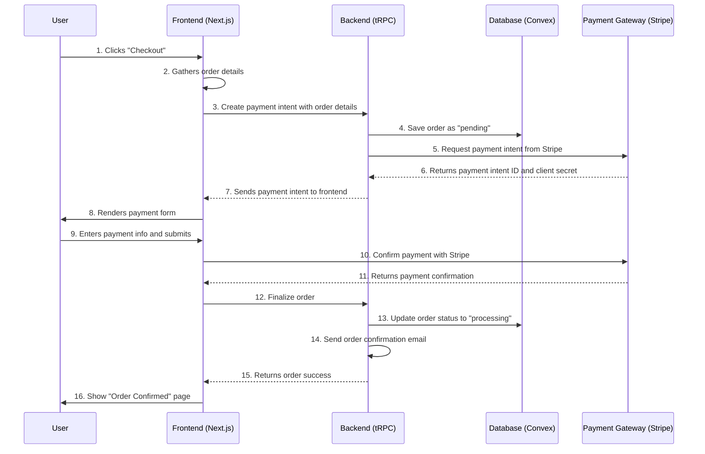

# Core Workflows

## Checkout Process

```mermaid
sequenceDiagram
participant U as User
participant FE as Frontend (Next.js)
participant BE as Backend (tRPC)
participant DB as Database (Convex)
participant PG as Payment Gateway (Stripe)

    U->>FE: 1. Clicks "Checkout"
    FE->>FE: 2. Gathers order details
    FE->>BE: 3. Create payment intent with order details
    BE->>DB: 4. Save order as "pending"
    BE->>PG: 5. Request payment intent from Stripe
    PG-->>BE: 6. Returns payment intent ID and client secret
    BE-->>FE: 7. Sends payment intent to frontend
    FE->>U: 8. Renders payment form
    U->>FE: 9. Enters payment info and submits
    FE->>PG: 10. Confirm payment with Stripe
    PG-->>FE: 11. Returns payment confirmation
    FE->>BE: 12. Finalize order
    BE->>DB: 13. Update order status to "processing"
    BE->>BE: 14. Send order confirmation email
    BE-->>FE: 15. Returns order success
    FE->>U: 16. Show "Order Confirmed" page
```