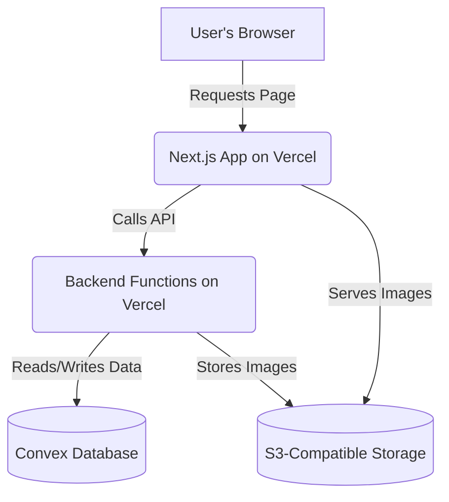

# High Level Architecture

## Technical Summary

The Monkkey webshop will be built on a modern fullstack architecture using the T3 stack. We will use a monorepo structure to house a Next.js frontend, backend API functions, and shared code. The platform will leverage a serverless deployment model on a modern cloud provider, ensuring scalability, reliability, and cost-effectiveness. A central database will store all product and order data, while the frontend will be built with a component-based approach that adheres to the UI/UX specification.

## Platform and Infrastructure Choice

We will proceed with Vercel as our deployment platform and Convex as our database backend. This combination is the most modern, efficient, and developer-friendly stack for our project.

## Repository Structure

We will use a Monorepo structure. All of our code—including the Next.js application, backend functions, and shared components—will be housed in a single repository. This simplifies dependency management, centralizes our codebase, and ensures full-stack type safety out of the box.

## High Level Architecture Diagram

## Architectural Patterns

Component-Based UI: The frontend will be built with reusable React components to ensure a consistent look, feel, and functionality across the entire site.

Serverless Architecture: We will use serverless functions for our backend logic, which will be cost-effective, scalable, and easy to deploy with Vercel.

Repository Pattern: We will abstract our data access logic to ensure that our application code is not tightly coupled to the database. This makes the code easier to test and allows us to change data sources in the future if needed.
